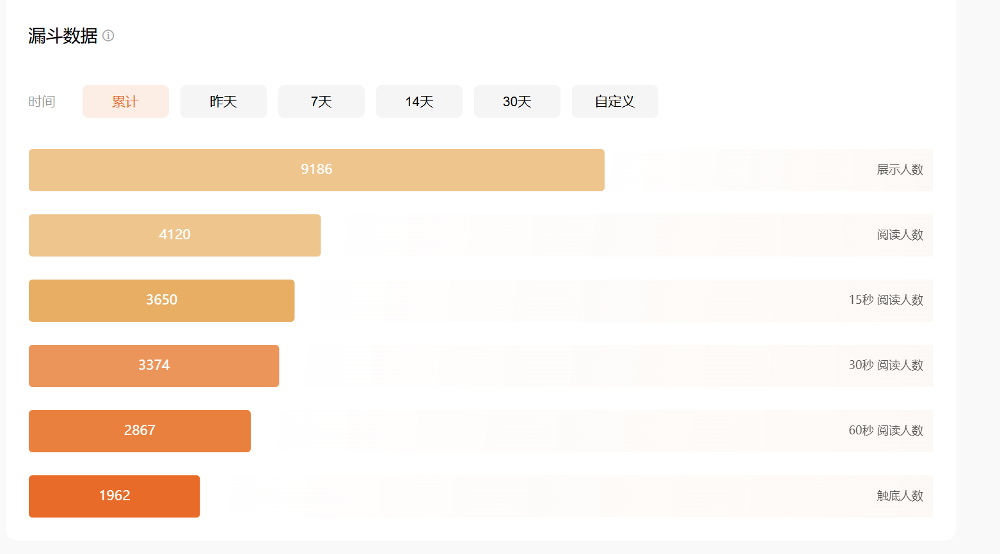

# Viral Short Story Workshop

> A workshop-style skill for writing high-retention Chinese short fiction with strong hooks, fast conflict, and mobile-friendly pacing.

中文爆款短故事与短爽文写作 skill。

这个 skill 不是教你“怎么把一句话写漂亮”，而是把平台型短篇拆成一套可执行工作流：先定入口，再定首屏，再定走向，最后按统一骨架落正文。它更适合需要高钩子、快冲突、强留存、强断点的中文短篇任务。



## ✨ 适用场景

- 写新短篇
- 做短篇选题
- 起标题、改标题
- 重写首屏
- 搭 8 节拍大纲
- 直接生成正文成稿
- 对爆款例文做结构学习
- 做短篇改稿、救稿、复盘

尤其适合这些方向：

- 短故事
- 付费短篇
- 短剧感爽文
- 强情绪中文故事
- 平台向手机阅读文本

## 🧠 核心思路

这个 skill 默认把短篇拆成三层：

1. 这篇靠什么让人点进来
2. 这篇靠什么让人停住
3. 这篇靠什么让人追下去

重点不是每次从零发明结构，而是先把这些关键位置定准：

- 标题
- 首屏
- 开局类型
- 剧情走向
- 正文节拍
- 结尾断点

一句话概括：

先卖入口，不先卖背景；先把读者按住，再把故事写深。

## ⚙️ 这个 skill 会做什么

它会优先推动模型按下面的顺序处理短篇任务：

1. 先写故事启动句
2. 判断开局类型
3. 判断剧情走向
4. 先起标题，再写首屏
5. 再落正文
6. 最后做去 AI 味和口语修整

默认正文结构采用统一节拍，不鼓励慢热长篇式铺垫。

## 🧱 默认成文格式

这个 skill 的一个重点是成文格式。

默认不是“第一章、第二章”的长篇章回体，而是更贴近平台阅读习惯的：

- `标题`
- `引言`
- `正文`

其中：

- 引言放在标题下面，用 5 到 10 个短段先把钩子立住
- 正文用 `1.` `2.` `3.` 这种数字分段推进
- 每段优先只推进一个动作、一个信息点或一层情绪变化
- 全文尽量适配手机滑读节奏

简化示意：

```text
标题

引言短段 1

引言短段 2

引言短段 3

1.

短句开场。

动作推进。

2.

继续加码。
```

## 🔢 字数规则

如果任务是完整正文、完整短篇、落地成文件，这个 skill 默认要求：

- 纯中文正文字数大于 8000

统计口径：

- 只计算中文汉字
- 不计算标点
- 不计算空格和换行
- 不计算阿拉伯数字
- 不计算英文字母
- 不计算文件名

如果用户明确要求更短篇幅，可以覆盖这条默认规则。

## 🚪 开局类型

skill 内置四种主入口：

1. 情绪受害型
2. 认知错位型
3. 外部声音介入型
4. 身份反差型

它们不是题材分类，而是“读者从哪一个钩子点被抓住”的分类。

## 📈 剧情走向

skill 内置五种常用走向：

1. 打脸反杀
2. 误会反转
3. 身份揭露
4. 规则解谜
5. 围观翻车

默认建议一篇短篇只保留一条主走向，不混成一锅。

## 📦 输出模式

这个 skill 会根据任务类型切换输出：

- `选题`：情绪承诺、开局类型、剧情走向、故事启动句、标题方向
- `标题`：多组标题候选，并标出最推荐的一条
- `首屏`：默认给 3 套入口版本
- `大纲`：输出 8 节拍结构
- `正文`：按“引言 + 数字段正文”直接成稿
- `改稿/分析`：先判断问题位置，再给改法
- `数据复盘`：拆成标题问题、首屏问题、承接问题、互动问题
- `仿写`：只保留机制和情绪结构，不保留原作指纹
- `落地成文件`：成稿后做润色、字数校验，再写入文件

## 🗂️ 目录结构

```text
Viral Short Story Workshop/
├─ README.md
├─ SKILL.md
├─ references/
│  ├─ title-and-hooks.md
│  ├─ story-structures.md
│  ├─ first-screen-playbook.md
│  ├─ title-verbs.md
│  ├─ outcome-hooks.md
│  ├─ platform-playbook.md
│  ├─ intro-to-chapter-bridge.md
│  ├─ revision-checklist.md
│  └─ data-retro-playbook.md
└─ agents/
```

其中：

- `SKILL.md` 是主规则文件
- `references/` 是配套资料
- `agents/` 如果你有额外 agent 配置，可以继续扩展

## 🧩 可选依赖

这个 skill 可以单独使用。

如果你已经安装了其他“去 AI 味 / 情感增强 / 口语修整”类 skill，可以在完整成稿的最后一轮接上使用。

例如：

- `$qiqing-liuyu`
- 其他同类润色 skill

但这不是强依赖。

没有外部 skill 时，依然可以按本 skill 的规则完成交付。

## 🛠️ 推荐使用方式

### 1. 写新短篇

先让模型输出：

- 情绪承诺
- 开局类型
- 剧情走向
- 故事启动句
- 5 到 10 个标题
- 3 版首屏

确认之后，再让它落正文。

### 2. 改已有稿子

先让模型判断问题更像出在：

- 标题
- 首屏
- 走向
- 正文节奏

然后只修最影响留存的那一层。

### 3. 做成稿

完整成稿时，建议要求它同时完成：

- 引言 + 正文数字分段
- 去 AI 味收尾
- 纯中文正文字数校验

## 🧪 一个简单示例

示例任务：

```text
Please use the "Viral Short Story Workshop" skill to write a modern romance sweet short story.
先给我：
1. 故事启动句
2. 开局类型
3. 剧情走向
4. 6 个标题
5. 3 版首屏
确认后再写正文
正文按“引言 + 1,2,3数字分段”的格式，完整成稿纯中文正文字数超过 8000。
```

或者直接一步到位：

```text
Please use the "Viral Short Story Workshop" skill to write a period short story.
要求：
- 引言 + 正文
- 正文按 1. 2. 3. 分段
- 节奏偏强冲突
- 完整成稿
- 纯中文正文字数超过 8000
```

## 🎯 风格提醒

这个 skill 默认更偏：

- 强入口
- 快推进
- 高留存
- 强站队
- 强断点

它不适合这些写法：

- 慢热散文式开头
- 前几段大量世界观介绍
- 没有核心矛盾的抒情文
- 讲道理多于讲现场
- 全文写完才给第一个钩子

## 👥 适合谁

如果你是下面这几类人，这个 skill 会比较有用：

- 想系统写平台短篇的作者
- 想拆解爆款结构的学习者
- 手上有题材但不会起标题和首屏的人
- 已经能写正文，但留存偏弱的人
- 想把“写作感觉”变成“可执行流程”的人

## 📄 License / 使用说明

如果你把它再分发或继续改造，建议保留原 skill 名称和说明，并明确哪些内容是你自己的二次修改。

如果你把它和别的润色类 skill 一起使用，也建议在说明里写清楚：

- 哪部分是结构规则
- 哪部分是语言润色
- 哪部分是你自己的追加工作流

这样别人接手时不容易混乱。
